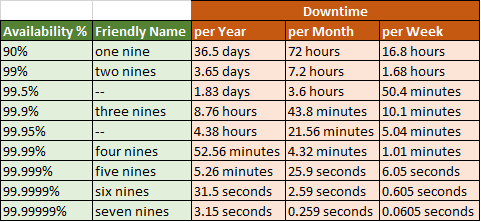

# Advanced-Programing
### Highlights
- IAS/Defensive Programming/Programming for Security
- Programming for Robustness and Maintainance
- IAS/Principles of Secure Design as the guidelines security trends

### Outline
| No. | Unit | Chapter (5th edition) | Covered |
| --- | --- | --- | ---- |
| 1 | Secure Software Development | | [x] |
| 2 | Planning for security | 10.1 | [x] |
| 3 | Requirements for security | 10.1 | [x] |
| 4 | Secure Design | 5.2 | [ ] |
| 5 | Secure Design Threat Modeling | 2 | [ ] |
| 6 | Secure Design Principles and practices |  | [ ] |
| 7 | Attacks on secure programming |  | [ ] |
| 8 | Robust Programs and mitigation |  | [ ] |

Availability Requirements
- Specifying in 9s terminology

[*Design for Availability – Game of 9s*](https://manishsharma.blog/2020/02/04/design-for-availability-game-of-9s/)

### References
[1] Charles Pfleeger, Shari Pfleeger, Jonathan Margulies. (2015). Security in Computing 5th Edition. Pearson Education, Inc.

